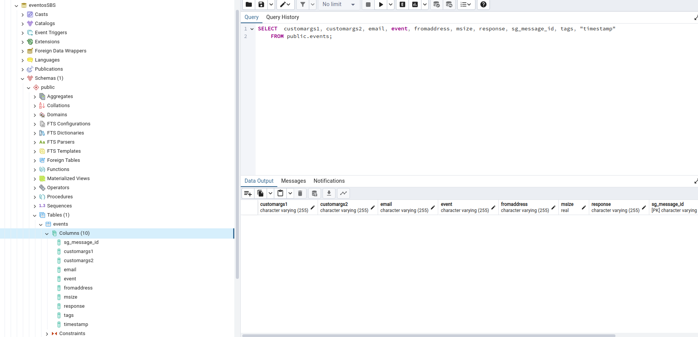
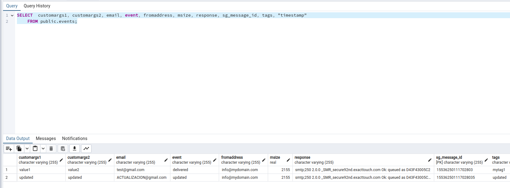

# SBS Test

# Daniel

## Instrucciones

Para un correcto funcionamiento, se debe utilizar una base de datos PostgreSQL. Después de haber creado la base 
de datos eventosSBS, el código creará la tabla necesaria.


spring.datasource.url = jdbc:postgresql://localhost:5432/eventosSBS

spring.datasource.username = daniel

spring.datasource.password = 123456

Clona la aplicación, compílala y ejecútala con Java 17. Debería funcionar correctamente y se creará en 
la base de datos eventosSBS la tabla eventos.



POST
http://127.0.0.1:9090/api/home
Request
```json
{
  "sg_message_id": "222",
  "response": "smtp;250 2.0.0 _SMR_secure92nd.exacttouch.com Ok: queued as 222",
  "email": "222@gmail.com",
  "timestamp": 222,
  "fromaddress": "222@mydomain.com",
  "event": "222",
  "msize": 222,
  "customargs1": "222",
  "customargs2": "222",
  "tags": "222"
}
```
Response
```json
{
  "sg_message_id": "222",
  "response": "smtp;250 2.0.0 _SMR_secure92nd.exacttouch.com Ok: queued as 222",
  "email": "222@gmail.com",
  "timestamp": 222.0,
  "fromaddress": "222@mydomain.com",
  "event": "222",
  "msize": 222.0,
  "customargs1": "222",
  "customargs2": "222",
  "tags": "222"
}
```

GET
http://127.0.0.1:9090/api/home
Request
```json

```
Response
```json
[
  {
    "sg_message_id": "222",
    "response": "smtp;250 2.0.0 _SMR_secure92nd.exacttouch.com Ok: queued as 222",
    "email": "222@gmail.com",
    "timestamp": 222.0,
    "fromaddress": "222@mydomain.com",
    "event": "222",
    "msize": 222.0,
    "customargs1": "222",
    "customargs2": "222",
    "tags": "222"
  },
  {
    "sg_message_id": "15536250111702803",
    "response": "smtp;250 2.0.0 _SMR_secure92nd.exacttouch.com Ok: queued as D43F43005C2",
    "email": "test@gmail.com",
    "timestamp": 1.55368166E9,
    "fromaddress": "info@mydomain.com",
    "event": "delivered",
    "msize": 2155.0,
    "customargs1": "value1",
    "customargs2": "value2",
    "tags": "mytag1"
  }
]
```

GET by Id
http://127.0.0.1:9090/api/home/15536250111702803
Request
```json

```
Response
```json
{
  "sg_message_id": "15536250111702803",
  "response": "smtp;250 2.0.0 _SMR_secure92nd.exacttouch.com Ok: queued as D43F43005C2",
  "email": "test@gmail.com",
  "timestamp": 1.55368166E9,
  "fromaddress": "info@mydomain.com",
  "event": "delivered",
  "msize": 2155.0,
  "customargs1": "value1",
  "customargs2": "value2",
  "tags": "mytag1"
}
```

PUT
http://127.0.0.1:9090/api/home/15536250111702803
Request
```json
{
    "sg_message_id": "155362501117028035",
    "response": "smtp;250 2.0.0 _SMR_secure92nd.exacttouch.com Ok: queued as D43F43005C25",
    "email": "ACTUALIZACION@gmail.com",
    "timestamp": 1553681625,
    "fromaddress": "info@mydomain.com",
    "event": "updated",
    "msize": 2155,
    "customargs1": "updated",
    "customargs2": "updated",
    "tags": "updated"
}
```
Response
```json
{
  "sg_message_id": "155362501117028035",
  "response": "smtp;250 2.0.0 _SMR_secure92nd.exacttouch.com Ok: queued as D43F43005C25",
  "email": "ACTUALIZACION@gmail.com",
  "timestamp": 1.55368166E9,
  "fromaddress": "info@mydomain.com",
  "event": "updated",
  "msize": 2155.0,
  "customargs1": "updated",
  "customargs2": "updated",
  "tags": "updated"
}
```
En caso de que se actualice el Id Spring tomara como un nuevo registro y lo almacenará.

DELETE
http://127.0.0.1:9090/api/home/222

Response

Elemento eliminado




## License

MIT

---

> [www.whynotstreet.com](https://www.whynotstreet.com) &nbsp;&middot;&nbsp;
> GitHub [@Orionk999](https://github.com/Orionk999) &nbsp;&middot;&nbsp;

> _Es genial trabajar con ordenadores. No discuten, lo recuerdan todo y no se beben tu cerveza.  Paul Leary_ 